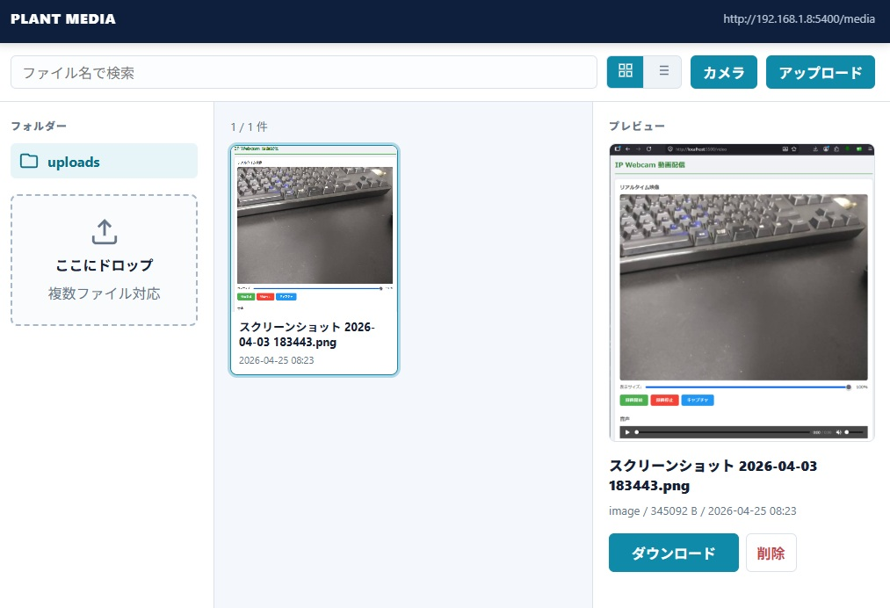

# Plant Media Manager / プラント メディア管理システム

A lightweight web application for transferring and browsing photos and videos captured on-site at industrial facilities. Designed for plant engineers using smartphones on the factory floor.

スマートフォンから現場の写真・動画を転送・閲覧するための軽量Webアプリです。プラントエンジニアの現場利用を想定した設計になっています。



---

## Features / 機能

- **File Upload / ファイル転送**
  - Camera capture and file selection from smartphone / スマートフォンからカメラ撮影・ファイル選択
  - Drag & drop support / ドラッグ＆ドロップ対応
  - Multi-file simultaneous upload with progress bar / 複数ファイル同時転送・進捗バー表示

- **File Browser / ファイル一覧**
  - Thumbnail grid view / サムネイルグリッド表示
  - Filename list view / ファイル名リスト表示
  - Supports images (JPG, PNG, GIF) and videos (MP4, MOV, AVI, WebM) and any other file types
  - 画像・動画・その他すべてのファイル形式に対応

- **Download / ダウンロード**
  - Direct download of any file from client devices / クライアント端末からの直接ダウンロード

- **Delete / 削除**
  - Delete files with confirmation dialog / 確認ダイアログ付きでファイル削除

- **Media Viewer / メディアビューア**
  - Full-screen image/video viewer with download button / フルスクリーンの画像・動画ビューア

---

## System Architecture / システム構成

```
Smartphone (Client)
      |
   Wi-Fi AP (hostapd)
      |
   nginx (port 80)  ←→  Flask app (port 5400)
      |
   dnsmasq (DHCP)
```

| Component   | Role                        |
|-------------|-----------------------------|
| hostapd     | Wi-Fi Access Point          |
| dnsmasq     | DHCP server                 |
| nginx       | Reverse proxy (port 80)     |
| Flask       | Web application (port 5400) |

---

## Requirements / 動作要件

- Python 3.10+
- Flask
- Nginx
- hostapd
- dnsmasq

---

## Setup / セットアップ

### 1. Clone the repository / リポジトリをクローン

```bash
git clone https://github.com/d-kawakami/media-kanri.git
cd media-kanri
```

### 2. Create virtual environment / 仮想環境を作成

```bash
python3 -m venv venv
source venv/bin/activate
pip install flask
```

### 3. Configure nginx / nginx設定

```nginx
server {
    listen 80;
    server_name _;

    location / {
        proxy_pass http://127.0.0.1:5400;
        proxy_set_header Host $host;
        proxy_set_header X-Real-IP $remote_addr;
    }
}
```

### 4. Configure systemd service / systemdサービス設定

```ini
[Unit]
Description=Plant Media Web App
After=network.target

[Service]
User=www-data
WorkingDirectory=/opt/webapp
ExecStart=/opt/webapp/venv/bin/python3 app.py
Restart=always

[Install]
WantedBy=multi-user.target
```

```bash
sudo systemctl enable webapp
sudo systemctl start webapp
```

### 5. Set upload folder permissions / アップロードフォルダの権限設定

```bash
sudo chown www-data /opt/webapp/uploads
```

---

## Access / アクセス方法

Connect your smartphone to the Wi-Fi AP, then open:

スマートフォンをWi-FiのAPに接続し、以下のURLにアクセスしてください。

| Page          | URL                        |
|---------------|----------------------------|
| Upload / 転送 | `http://192.168.1.250/photo` |
| File list / 一覧 | `http://192.168.1.250/list` |

> Replace `192.168.1.250` with the IP address of your AP interface.
> `192.168.1.250` はAPインターフェースのIPアドレスに合わせて変更してください。

> **Note:** The URLs above assume nginx is running as a reverse proxy on port 80 (the default HTTP port).
> If you access Flask directly without nginx, append `:5400` to the URL (e.g., `http://192.168.1.250:5400/photo`).
>
> 上記URLはnginxがポート80のリバースプロキシとして動作している場合のものです。
> nginxを使わずFlaskに直接アクセスする場合は `:5400` を付けてください（例：`http://192.168.1.250:5400/photo`）。

---

## Directory Structure / ディレクトリ構成

```
/opt/webapp/
├── app.py              # Flask application
├── README.md
├── uploads/            # Uploaded files (www-data writable)
├── static/
├── templates/
│   ├── index.html      # Upload page
│   ├── list.html       # File browser
│   └── image.html      # Media viewer
└── venv/
```

---

## License / ライセンス

MIT License
